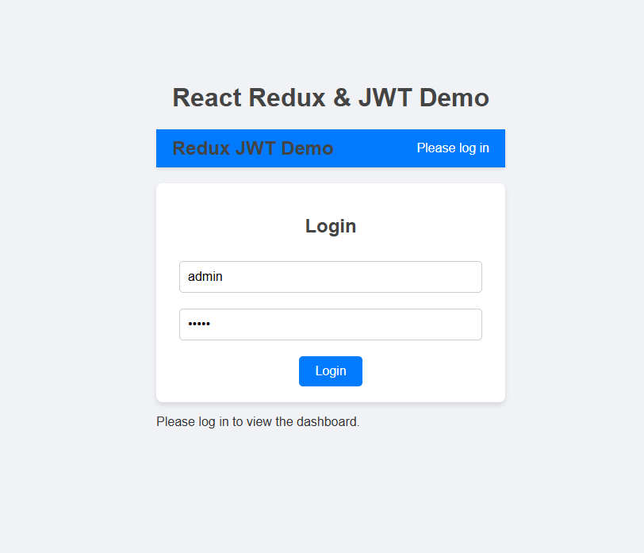
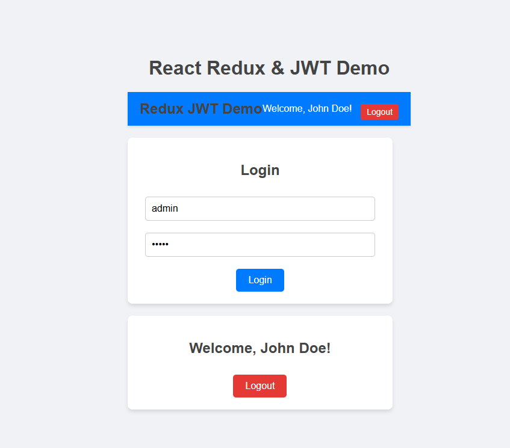

Redux and JWT Demo Application
Overview
This project demonstrates the use of React Redux for state management and JWT (JSON Web Token) for user authentication. It showcases how to:

Manage global state using Redux Toolkit.
Simulate user authentication with JWT decoding.
Create a simple Login and Dashboard interface.
Features
Login Functionality:

User can enter email and password to "log in".
Simulates an API call to return a JWT token.
JWT token is decoded to retrieve user information.
Redux State Management:

User data and token are stored in the global Redux store.
Dashboard retrieves user information from the Redux state.
Protected Dashboard:

Displays a welcome message for logged-in users.
Allows users to log out, clearing their data from the Redux state.
Technologies Used
React: For building the user interface.
Redux Toolkit: For state management.
JWT-Decode: For decoding JWT tokens.

